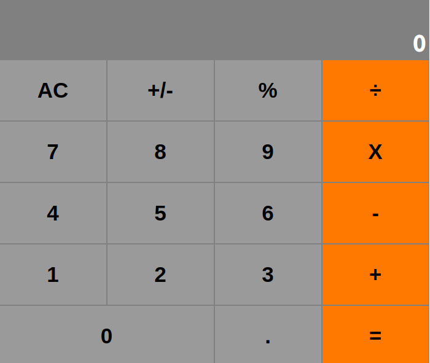

# Milestone 3 

> In this Milestone, I performed the following actions;
  - Styled the following components
    - App.js
    - Button.js
    - ButtonPanel.js
    - Display.js
  - CSS flex box is used to display App, Display and ButtonPanel components
  - Calculator width is set to 700px ( ```.common-width```)

  - Display
    - Background-color is set to gray
    - Height set to 100px
    - The result has white and bold text
    - The result has padding
    - The result is aligned to the right
  - ButtonPanel
    - Each row of button group is set to 100px
    - The button groups is displayed horizontally in rows
  - Button
    - Buttons take 25% of the full width of the containner, except for ```0```
    - The text button is centered and displayed in black color
    - Each button has a border
  - Pass ```color``` and ```wide``` props
    - The color prop is used to customize the color of the button
    - The wide prop should accept a boolean
 - Fix linter errors with the following commands
    - ``` npx stylelint "**/*.{css,scss}" ``` for stylelint
    - ``` npx eslint . ``` for eslint 


## Tools To Work With

- Node.js
- React
- React-DOM
- React-Create-App
- npm
- React
- Heroku

## Deployment

- ``` heroku create $APP_NAME --buildpack mars/create-react-app```
- ``` git push heroku Milestone-1:master ```
- ` heroku open `

## Live Demo

[Live Demo Link](https://calculator-20.herokuapp.com/)


## Getting Started

To get a local copy up and running follow these simple example steps.

1. ``` git clone https://github.com/addod19/calculator.git ```
2. ``` cd calculator ```
3. ``` git checkout  start```
4. ``` yarn i ```
5. ``` yarn start ```

## Screenshot


This project was bootstrapped with [Create React App](https://github.com/facebook/create-react-app).


### Prerequisites

- A modern browser

## Authors

👤 **Author1**

- Github: [@addod19](https://github.com/addod19)
- Twitter: [@DanielLarbiAdd1](https://twitter.com/DanielLarbiAdd1)
- Linkedin: [Daniel Larbi Addo](https://linkedin.com/in/daniel-larbi-addo/)
- Email: (addodaniellarbi@gmail.com)

## 🤝 Contributing

Contributions, issues and feature requests are welcome!

Feel free to check the [issues page](https://github.com/addod19/calculator/issues).


1. Fork it (https://github.com/addod19/calculator/fork)
2. Create your feature branch (git checkout -b my-new-feature)
3. Commit your changes (git commit -am 'Add some feature')
4. Push to the branch (git push origin my-new-feature)
5. Create a new Pull Request

## Show your support

Give us a ⭐️ if you like this project!

## Acknowledgments

- MIcroverse
- Microverse TSE's

## 📝 License

This project is [Apache](lic.url) licensed.
